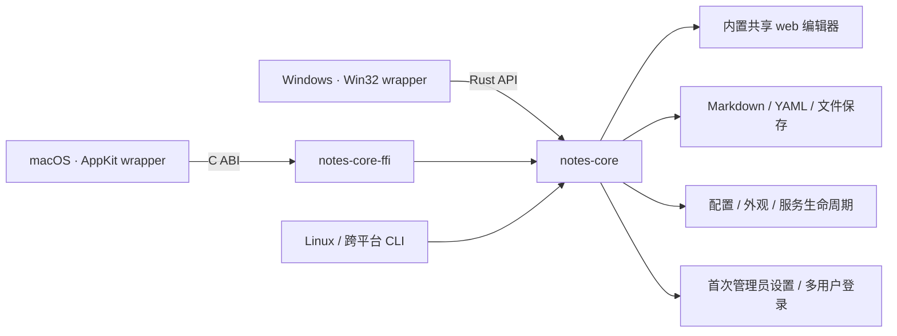

# Notes App

基于 **notes-core + 平台薄壳** 的轻量本地 Markdown 编辑器。Windows、macOS 和 Linux CLI 共用同一份 Rust 核心与网页编辑器；系统默认浏览器提供保留排版的 Live 编辑。

**不依赖 Python、MkDocs、.NET、Windows App SDK 或 WebView2，也不打包浏览器。** 笔记仍然是自己目录中的 `.md` / `.markdown` 文件，不导入数据库、不上传云端。

## 架构



| 目录 | 职责 |
| --- | --- |
| `crates\notes-core\` | 共享服务、用户认证、Markdown/YAML 渲染、受限文件访问、版本冲突保护、配置和 `NotesCore` 控制器 |
| `crates\notes-core-ffi\` | 将控制器暴露为小型 C ABI，供 Swift 等宿主调用 |
| `crates\notes-cli\` | 跨平台命令行适配器，负责参数、退出信号及诊断文件，不包含桌面 UI |
| `web\` | 浏览器应用壳、API 状态管理、生成资源和端到端测试 |
| `web\editor\` | 独立 `@notes-app/editor` package，包含 Milkdown、CodeMirror、KaTeX、Markdown 语义、滚动条、单测和性能基准 |
| `apps\windows\` | Win32 托盘、设置窗口、目录选择、系统浏览器/文件管理器调用 |
| `apps\macos\` | AppKit 托盘和设置窗口，通过静态链接的 C ABI 使用同一个 core |
| `Shared\Resources\` | 共用的 SVG、PNG 和 ICO 图标 |

平台壳不再启动 MkDocs 或实现另一套文件/渲染逻辑。新增 Rust 宿主可调用 `NotesCore::new`、`save_settings`、`start`、`stop` 和 `open_url`；其他语言使用 `crates\notes-core-ffi\include\notes_core.h`。C ABI 返回的字符串必须由 `notes_core_string_free` 释放，句柄须串行使用并在退出时释放。文件访问的 Windows handle / Unix descriptor 适配仍由 core 统一管理。

## 桌面使用

1. 双击 `Notes.exe`，首次运行在 Settings 中选择存放 Markdown 的目录。
2. 首次打开浏览器时创建本机管理员账号；Windows、macOS 和 Linux CLI 共用同一套网页设置及登录流程。
3. 登录后选择笔记，直接在排版后的正文里编辑。标题、加粗、列表和表格会保持原有格式，并随输入动态更新。
4. 停止输入后默认 1 秒自动保存，也可按 **Ctrl+S** 立即保存；未保存修改用页面标题及浏览器标题中的 `*` 表示，保存完成后自动消失。底部不显示 Saved 或未保存的常驻文本，仍保留保存中、只读、冲突和错误提示。关闭浏览器不会停止服务；左键点击托盘图标直接打开网页，右键打开菜单。

更换目录或端口前，需要先从托盘停止当前服务；保存新设置后再启动。关闭或重启服务前请先保存浏览器中的修改。

Settings 提供 Editor、Appearance、Layout、Library、Git、Performance、Accessibility 和 Shortcuts 配置，管理员另有 Users 账户管理页面。主题、字体、字号、行高、自动保存、默认视图、隐藏规则、刷新间隔和性能选项由本地服务共享并原子持久化；页面宽度、侧栏宽度和快捷键同时保留浏览器本机覆盖。字体只使用本机已安装的字体，不下载网络字体。

不需要 `mkdocs.yml`、虚拟环境、预先构建站点或启动其他服务。支持文件夹导航、筛选、新建笔记、标题大纲、列表、任务列表、引用、代码块、表格及相对图片/笔记链接。页面跟随浏览器的明暗主题，所有编辑器脚本随 EXE 内置，无 CDN 依赖。小型 Source 文档使用原生 textarea，达到 768 KiB 时按需切换到 CodeMirror 虚拟编辑器。

界面是一张连续的写作页面：顶部菜单直接显示当前 Live、Source、Compare 或 Read 状态；Live 空段落输入 `/` 可选择标题、列表、引用、代码块、表格和分隔线。命令面板按钮默认隐藏，仍可用 `Ctrl+K` 或自定义快捷键打开。左侧 Files、Outline 和 Git 面板可以隐藏或拖动边界调整宽度。

| 快捷键 | 操作 |
| --- | --- |
| `Ctrl+S` | 保存 Markdown |
| `Ctrl+Shift+L` | 显示/隐藏左侧栏 |
| `Ctrl+Shift+1` | 显示大纲 |
| `Ctrl+/` | 切换完整源码和实时编辑 |
| `Ctrl+K` | 打开全局命令面板 |

文件树显示安全的空目录。文件和 `index.md` 的 YAML `title` 会替代物理名称作为显示标题；物理路径用于展示和磁盘定位，文档 URL 使用独立的资源 UUID。将鼠标移到文件夹标题可在该目录中新建笔记或子目录；文件右键可查看详情或重命名，文件和目录可拖入其他目录。移动和重命名遇到同名目标时会拒绝操作，不自动覆盖。

浏览器标题优先显示文档的 YAML `title`，没有标题时显示文件名而非完整路径，未保存时仍带 `*`。新建笔记只需填写 Title，无需路径或扩展名；默认放在当前文档所在目录，也可从目录操作指定位置，表单会预览生成的文件路径。文件名保留 Unicode，替换不兼容字符并限制 UTF-8 长度，重名时明确提示，不覆盖已有文件。所有新建模板（包括空白笔记）都写入 YAML `title` 和 `created`；`created` 是创建时浏览器生成的 UTC ISO 8601 时间，普通编辑、保存和移动不会改写它。日记、周记和会议模板继续保留日期、标签和正文；切换模板不会覆盖已填写的自定义标题。

Settings 的 Library 页面支持按相对路径 Glob 隐藏文件和目录，每行一条，例如 `drafts/**`、`*.private.md`，并可配置自动刷新。`*` 不跨目录，因此 `*/index.md` 只匹配一级子目录；`**/` 匹配零层或多层目录，使用 `**/index.md` 可隐藏 Project 根目录及所有子目录中的 `index.md`，`docs/**/index.md` 则覆盖 `docs/index.md` 及更深层的同名文件。规则不能重新显示 core 强制排除的隐藏目录、依赖目录、符号链接或联接目录。

Git 面板显示分支、upstream、ahead/behind、逐文件 staged/working 状态和安全的行级 diff，并支持 Stage、Unstage、Commit、fast-forward-only Pull 和显式确认 Push。notes 目录必须本身就是仓库根；不接受任意 Git 命令，hooks、pager、外部 diff、fsmonitor、未知 transport 和交互式凭据提示均被禁用。远端认证由用户现有的 Git/SSH/credential helper 配置负责，Notes 不保存凭据。

Git 文件列表按 Staged changes / Changes 分组，文件名与目录分行显示，`+` 暂存、`−` 取消暂存；点击文件查看对应组的差异。同一个文件可同时出现在两组中，提交框固定在底部，刷新状态不会清空提交说明。文件数量只在分组标题显示；悬停和键盘焦点均使用统一圆角底色，不添加侧线或下划线。错误与操作进度仍明确显示。

**Settings → Git → Auto commit and push this project** 可按 Project 配置定时提交并推送，仅项目所有者可查看或修改。默认关闭、默认间隔 30 分钟，可设为 1–1440 分钟。保存启用时需要确认：后台会暂存该仓库全部已保存的非忽略文件（包括其他用户修改、附件和删除），有变更时创建 `Notes: automatic sync` 提交，再推送已有及新提交；无变更时不生成空提交。遵守 `.gitignore`，但 Notes 隐藏规则及页面共享权限不是 Git 排除规则；未保存的浏览器/协作草稿不在本次提交内。

定时任务属于 Rust 后台服务，浏览器关闭或退出登录不影响执行；配置持久化，服务重启后重新等待完整间隔，运行结果和下次时间在 Settings 显示，失败通过底部状态区提示并在下一间隔重试。启用前需配置 Git 作者身份及分支 upstream；任务绑定启用时的分支、上游及推送地址，改变后需关闭再启用确认新目标。不会自动 Pull、强推或处理冲突；合并/变基进行中会拒绝运行，推送失败保留本地提交。自动提交禁用 hooks 和交互式签名；手工提交行为不变。共享库上的多个服务通过仓库锁避免重复运行，所有者账户删除后停止自动写入。

按钮、侧栏切换项、菜单和列表统一使用 6px 圆角及轻量底色区分悬停、选中和键盘焦点，不使用底部高亮条；输入框使用完整的内侧细边，Live、Source 和 Read 正文保持无外框。Live 中 Ctrl+点击选中段落、标题等块时不添加底部装饰横线，块选择及 Ctrl+点击打开链接的行为保持不变。系统强制高对比模式仍保留 1px 内侧焦点轮廓。侧栏底部不再重复显示目录名和笔记数量，刷新文件入口位于侧栏顶部，目录信息仍可在 Settings → Library 查看。

侧边栏、正文、源码和预览使用细浮动滚动条：滚动或移动鼠标时显示，闲置后淡出，不占据正文宽度；溢出出现/消失不会挤动布局。仍可使用滚轮、键盘、触摸和拖动滑块滚动；高对比度模式下保留清晰的滑块。

笔记始终保存为 **Markdown 文件**。Live 模式在保留排版的页面里编辑；需要精确操作语法时，可切换 Source、源码与预览对照的 Compare，或只读的 Read。加载、连接、Git、保存和错误消息统一显示在底部固定状态栏，不占用正文或侧栏高度；`…` 可查看完整消息，表单错误在同一区域的浮层显示。

### Projects 与共享

文档、目录和附件采用独立生成的 UUID v7，用户模式存储在项目工作区 SQLite 中；不是路径、标题或内容的哈希。文档地址使用 `/?project=<project-id>&document=<uuid>`，文档 API 使用 `/api/document?id=<uuid>`，附件使用 `/assets?id=<uuid>&document=<source-document-uuid>`。创建、重命名和解析 Markdown 相对链接的请求体仍携带路径；旧 `file`/`path` 文档 URL 不提供兼容转换。项目 ID、历史版本序号和公开分享令牌各自保持其原有用途，UUID 本身不授予访问权限。

应用内移动保持资源 UUID，删除后在同路径新建不会复用旧 UUID 或其历史，回收站恢复则使用被回收资源的身份。Markdown 源文档仍保留可移植的相对路径；渲染时解析为资源 URL。外部 Git/文件管理器移动不做内容相似度匹配，无法确认身份时不会猜测新位置。诊断 token 模式的身份表仅存在于当前服务进程，不提供跨重启书签保证。

用户模式下，左上角的项目名称打开 Projects：每个用户可创建多个私有目录项目、克隆 GitHub 仓库，管理员还可接入已有的服务器绝对目录。目录项目与 GitHub 项目都以本地文件夹存储 Markdown；不能接入 Notes 的账户存储目录或与已有项目重叠的目录。原 CLI `--serve` 目录首次访问时迁移为初始管理员拥有的私有 `default` Project，其他用户不再自动获得访问权限。诊断 token 模式保留单目录行为。

Projects → Manage 可设置名称、图片目录和面向**所有已登录用户**的共享权限：不共享、只读或共同编辑。单篇笔记在右上角 More → Share page 打开 Document permissions，可选择继承 Project、仅所有者可见、登录用户只读/编辑或公开链接。独立文档权限优先于 Project 权限，可以把共享项目内的一篇笔记设为私有或只读；所有者始终保留管理和编辑权限。恢复 Inherit Project permission 会移除该文档的独立规则及公开链接。

公开分享仅针对单篇文档，选择 Public link 并保存后生成免登录链接，**默认匿名只读，且不加入协作房间**。单独勾选 Allow anonymous editing 并保存后，访客可编辑；另一位获授权编辑者打开同一文档时，才启动 Live、Source、Compare、Metadata 和图片粘贴的实时协同，显示临时 `Guest` 身份与彩色光标。公开链接不会开放项目列表、其他文档、账户设置或 Git；只读限制同时由 HTTP 和协作准入校验，而非仅禁用编辑器。

公开会话建立时只读取并验证源文档，HTML 在实际取文档时生成，避免打开链路重复渲染。命中已有文档缓存时可仅复制源文档字段，不复制 HTML；缓存读取仍重新检查文件指纹，外部修改、无效内容和已删除文件不会被忽略。

访客会话按到期时间索引清理，避免每次建立会话扫描所有尚未过期的记录；旧数据库会自动补建该索引，不改变会话期限、密码校验或 SQLite 持久化级别。

公开链接相当于访问凭据，应只发给需要访问的人。所有者可切换为非公开权限来关闭链接，或选择 Reset public link 生成新链接；旧链接、旧访客连接随后失效，降为只读也会更新已连接访客的编辑权限。链接会跨服务重启保留，不默认设置过期时间。公开分享不会自动将本地服务暴露到公网，接收方仍需要能访问当前服务地址，例如使用既有 SSH 转发。

单页接收者只能读取该页及所有者批准的附件；新粘贴图片随该页授权，手工新增已有附件引用后可重新保存文档权限来更新附件清单。私有文档不会出现在其他用户的文件树或目录标题中，其正文与附件受保护；项目存在私有文档时，Git 状态和差异只对所有者开放，以免泄露私有文件。已有独立权限的文档移动前需要恢复继承，非所有者在项目有独立文档权限时不能移动目录。

Project 的文件、缓存、Git 操作和协同房间彼此隔离；共享设置持久保存，撤销访问后现有协同连接也会停止接收更新。只读用户仍可实时查看、选择和复制内容，但不能编辑、创建页面或上传图片。共享管理及 Git 写操作仅项目所有者可执行；Git Pull 前需退出该 Project 内的协同会话，避免拉取覆盖正在编辑的页面。改密码不改变项目归属，删除账户后重新注册同名用户不会继承旧项目。

GitHub 项目接受 `owner/repository` 或 `https://github.com/owner/repository`，克隆最长等待 120 秒。私有仓库和 Push 使用该 Project 独立配置的 GitHub token，建议使用仅授权目标仓库 Contents 读写的细粒度 token；Manage 可替换 token。token 仅保存在服务端权限受限的项目目录配置中，不会通过共享 API 返回，也不写入 URL、进程命令行或 `.git/config`。GitHub 项目不继承服务器其他用户的 credential helper；Git 默认提交身份为创建者的本地用户名与 `<username>@notes.invalid`，可在本地仓库 Git 配置中调整。已有服务器仓库仍使用其既有 Git 配置。

### 粘贴图片

在 Live、Source 或 Compare 的编辑区使用 **Ctrl/Cmd+V** 可粘贴剪贴板中的 PNG、JPEG、GIF、WebP 图片，服务验证图像后生成不重名文件并插入相对 Markdown 引用，协同编辑者会同步看到图片。单张最多 16 MiB；图像解码还有尺寸与内存上限，不能用图片上传任意文件或覆盖已有文件。

默认图片目录为 Project 根目录下的 `assets/images`，可在 **Settings → Library → Pasted image directory** 或 Project 的 Manage 中修改。只允许安全的项目内相对路径，所需子目录自动创建，不会沿符号链接写到项目外。只读页面不允许粘贴上传。斜杠菜单使用紧凑圆角列表，支持鼠标、上下方向键、Enter 和 Esc，打开菜单不会把焦点移出编辑器。

图片也可拖放到 Live / Source 编辑区的指定位置。Settings → Library 可设置最大边长、无损 WebP 压缩或白底 JPEG 及其质量；默认不修改原图，不放大图片，动画保留原始文件。未缩放且转换后更大的图片会保留原文件，并明确提示。

### 标签、全文搜索与工作区

Metadata 支持 `tags: [research, 中文]`，兼容单个 `tag`。展开 Metadata 后可直接新增/移除标签；没有 YAML 头的笔记可通过 More → Edit tags 添加。编辑标签只改对应 YAML 值，不重排其他字段或正文；带逐项注释的复杂标签列表需要直接在 YAML 中修改，避免丢失注释。每篇最多 64 个标签，每个最多 80 个字符，大小写相同的标签会去重。

点击标签或按 **Ctrl/Cmd+P** 打开全文搜索，可限定当前/所有可访问 Project，以及标题、正文、Metadata；多个标签组合过滤。搜索和标签统计均执行最新的文档权限检查，也遵守隐藏路径规则；匿名公开页面不能浏览工作区搜索。首次搜索会分批建立 SQLite FTS 索引，后续按文件指纹增量更新，结果以最多三行摘要显示，高亮匹配内容，可用上下方向键选择、Enter 打开完整笔记。

空查询和标签浏览不会为所有匹配笔记加载正文，只按需读取最多 100 条可见结果的摘要来源；标签统计仍覆盖全部有权限且符合筛选条件的笔记。标题、正文和 Metadata 查询只读取需要的匹配字段，权限与文件指纹仍逐项检查。索引保留逐篇事务，避免批量写入长时间占用工作区存储；取消请求时同时回滚文档行和全文索引，扫描进度不会跳过未提交项。

More → Favorites and recent notes 提供收藏和最近访问，菜单文字会显示当前可执行的添加/移除收藏操作。不再显示多文档标签栏或固定标签功能；打开笔记不会累积标签，也不受旧版 128 个标签的限制。More 菜单分组显示，短窗口内可滚动访问全部操作；窄屏 Settings 使用可横向滚动的分类栏，底部保存与取消按钮保持可见。数据按账户保存在服务端，可跨浏览器恢复；当前打开的笔记保留在各浏览器本机，新浏览器默认打开最近访问的笔记。最多保留 512 个收藏和 100 个最近访问项，切换账户不会把上一账户的编辑内容带入新账户。旧版标签记录保留在存储中用于兼容，但不再出现在界面。

重复记录同一最近访问项或重复设置收藏时，若保存状态完全相同，就保留原 revision、不提交数据库写入；标题、顺序或实际内容变化仍原子保存。跳过写入不会跳过当前文档的访问权限检查。

SQLite WAL 可用时，工作区读取和访客凭据查询使用独立只读连接，读取当前已提交快照，避免等待索引写入；未提交数据不可见，也不缓存工作区内容或授权结果。访客凭据仍逐次校验，并在查询完成后检查到期时间。写入仍使用 FULL 同步。WAL 不可用时保留原串行路径并明确记录提示，避免改变不支持 WAL 的存储行为。

收藏/最近访问窗口先显示当前账户已加载的数据，再异步刷新；刷新失败会在状态区提示。Rust 记录工作区标题时只读取和验证 Markdown 源文档，不渲染正文。Live/Source 保留 Rust 返回的预览 HTML，但只在切换到 Read/Compare 时构建预览 DOM；文档或编辑版本变化时会失效，避免显示旧内容。

Rust 预览渲染通过单次 Markdown 解析同时生成正文与标题锚点，只缓冲当前标题的行内事件，保持重复标题编号、Unicode 锚点、链接重写及 HTML 转义规则不变。切换文档时，Source 滚动复位与同一帧的界面更新合并，避免中途强制布局；过期文档的回调不会影响新文档。

### 历史、回收站与本地恢复

项目所有者可在 More → History 查看保存版本、比较差异、复制或恢复旧内容。历史按 **30 天、每篇最多 100 个版本** 保留，不删除当前 Markdown 正文。恢复保持原有 BOM、换行和字节内容，会让同一服务中已连接的编辑者重新打开该文档；公开分享权限不会因此自动改变。匿名访问及普通共享编辑权限不包含历史版本访问。

读取版本内容时，SQL 只获取该项目、文档 UUID 和版本的已提交数据，随后释放数据库连接再解压和验证，避免占住连接执行较重的处理。到期限制、内容校验和所有者权限保持不变；历史列表的基线记录和回收站清理仍走原有写入流程。

More → Move note to recycle bin 将笔记移入回收站；More → Recycle bin 可在 **30 天**内恢复。恢复不会覆盖同名文件，原公开链接保持失效，已删除笔记恢复后仍为私有。More → Attachments 检查图片/PDF 的 Markdown 引用，所选未引用文件经确认后进入同一回收站，不直接永久删除。清理前必须关闭协同会话并处理待恢复草稿；检查只涵盖保存的 Markdown，其他应用和离线草稿仍可能使用这些附件，因此必须人工确认。

未同步的浏览器草稿会自动保存到加密 IndexedDB；账户草稿使用服务端持久化的独立恢复密钥，公开页面草稿按分享链接隔离。同一协同房间重新连接时，会合并未确认的 CRDT 修改；无法安全合并时，可在 More → Local recovery 查看、复制或明确应用草稿，不会静默覆盖新版内容。

历史、回收站、协作更新、索引、用户工作区和恢复密钥保存在用户配置目录下 `projects-<scope>/.state/workspace.sqlite`，不写进笔记仓库。备份应包含该目录；停止服务后备份，或使用 SQLite 一致性备份工具，避免漏掉 WAL。删除这份数据库也会丢失恢复密钥，使已有加密浏览器草稿无法解密。

### 双链、分享管理与模板

支持 `[[Note]]`、`[[folder/Note.md|显示名称]]` 和带标题锚点的双链；未写扩展名时使用 `.md`。Live 输入 `[[` 可从当前可访问笔记中补全，生成明确的项目内路径；Ctrl/Cmd+点击打开目标，More → Backlinks 显示有权限读取的反向引用。重命名/移动默认更新 Markdown 与双链引用，保留其余文本；扫描不完整、存在未保存协作草稿或引用文档不可安全修改时会拒绝操作，也可明确关闭自动更新。发生写入失败会尝试回滚，原版本保留在 History。

More → Public links 集中管理自己各 Project 的公开链接。Document permissions 可设置有效期和可选密码；密码采用 Argon2id 哈希，访问凭据保存在 HttpOnly Cookie，最长 12 小时。过期、撤销、重置链接或更换密码会使旧访问失效。访客修改以临时会话名称记录在保存历史中，不采集 IP 或推断真实身份；撤销访问不能抹去访客已下载的内容。

New note 可选择空白、日记、周报或会议记录模板，自动生成日期、任务清单与对应标签。创建遇到同名文件会拒绝覆盖。

### 多人协同编辑

**打开文档默认保持单人编辑，不立即创建 CRDT 房间或 WebSocket。** 只有项目或页面明确开放共同编辑，且另一位获授权编辑者打开同一文档时，才自动启动协作；私有页面覆盖项目共享设置，拥有者可写不等于已允许协作。同一账户的多个窗口不会单独触发协作，匿名访客按临时访客会话区分。只读共享维持普通阅读，不连接编辑房间。

登录用户的权限检查在当前调用内借用最新的不可变项目快照，不复制整份页面规则，也不跨请求或消息复用授权结果。默认项目解析只执行必要的初始化与归属确认，不额外生成随后丢弃的项目列表。

客户端通过轻量参与状态发现其他编辑者；启用前先短暂锁定输入并保存待处理草稿，所有参与者准备好后，Rust 服务端才允许入房，并阻止普通 HTTP 保存与 CRDT 激活竞争。冲突或待恢复草稿不会被静默覆盖，可从状态区或 Local recovery 处理；准备期间可点击 Preparing 暂停本页自动协作。离开页面会撤销参与状态，连接中断的状态最多保留 15 秒。已有协作会话可重连，最后一位其他参与者离开后，当前会话保持到本页退出，避免保存模式反复切换。

协作启动后，Live、Source、Compare 与 Metadata 可混合编辑，以 Yjs/Yrs 文本 CRDT 合并并发修改，而不是用最后一份全文覆盖其他人。顶部显示用户名首字头像；头像彩色边框与正文中的同色光标、姓名标签对应。获编辑授权的参与者切换到 Read 视图时仍能跟随会话；撤销编辑权限后退出房间，保留未同步的本地草稿。

共享草稿由服务端按自动保存间隔统一落盘，保留 Markdown/YAML、BOM、换行习惯和磁盘版本检查。撤销/重做只操作当前编辑者自己的修改。中文输入法组合期间会暂存远端更新，提交输入后再合并；连接中断时保留本地文本，同一服务会话恢复后自动同步。

每个房间最多 12 个连接，每个 Project 内存中最多保留 16 个协同文档；单篇笔记仍限 4 MiB，协同历史另有限额。用户模式下，服务先将接受的 CRDT 更新写入 SQLite WAL，再确认并广播；房间身份与草稿可跨服务重启恢复。外部磁盘修改与恢复草稿冲突时不会覆盖磁盘，所有者可从 History 处理恢复版本。最后一位编辑者断开连接时，服务会立即尝试保存没有保存错误的已接收修改，不再等待自动保存延迟。保存后可点击 Sharing 离开协同；移动或重命名涉及引用时需退出受影响笔记的会话。文档租约阻止另一个 Notes 服务同时接管同一协同文档。诊断 token 模式仍通过 Collaborate 手动加入，不提供账户工作区持久化。

### 邀请码与账户管理

初始管理员在 **Settings → Users** 中生成一次性邀请码，有效期可选 1 小时、24 小时或 7 天。邀请码仅创建时显示明文，用户库只保存其哈希。新用户在登录页选择 **Create account with an invitation**，输入邀请码并自行设置用户名、密码；成功创建账户与消费邀请码是同一次原子写入，并发兑换也只能成功一次。

管理员可查看账户、调整管理员/普通用户角色、重置密码、删除账户和撤销邀请码。普通用户不能访问这些管理接口，不能删除或降级最后一名管理员；账户管理不会删除笔记文件。角色、密码或账户变更会撤销当前服务中的该用户会话。新用户只能访问自己的 Projects 及其他所有者明确共享的 Projects/页面。

### MkDocs YAML 头信息

支持文档开头由 `---` 包围的 YAML 元信息，例如：

```markdown
---
title: "一篇笔记"
description: >-
  用于记录写作和阅读。
tags: [notes, writing]
custom:
  keep: true
---

# 正文标题
```

也支持以 `...` 结束头信息，以及 BOM、LF / CRLF 换行。头信息在 Live 模式中只显示一个可折叠的 Metadata 标题，展开后直接编辑原始 YAML，不会渲染成正文的分隔线或标题，也不会进入大纲。修改正文会保留头信息的注释、字段顺序、引号和未知字段；只修改头信息不会重新排版正文。YAML 语法问题会明确提示，原文不会被静默丢弃。

文件列表读取 YAML 标题时遇到头部结束标记即停止，不再因正文超过 64 KiB 而丢失标题。头部扫描仍限 64 KiB（另允许 1 字节判界），支持 BOM、LF、CRLF 和裸 CR；缓存继续按文件指纹失效，不扫描或改写正文来更新标题。

### 保存与兼容性

- 默认在停止输入 1 秒后自动保存，Ctrl+S 可立即保存。保存仍使用版本检查；文件被其他程序修改后提示冲突并保留当前编辑内容，绝不静默覆盖。
- 保存先写临时文件，再替换原文件；保留 UTF-8 BOM 和原有常见换行格式。未经编辑的文件不会仅因打开而重写。
- 打开、选中或移动光标不会自动改写文件。Live 模式实际修改正文时，Markdown 的语法排版可能被规范化；需要逐字控制时使用源码模式。行内 `$...$` 和块级 `$$...$$` 公式在 Live 中是普通可编辑文档内容：点击渲染公式即可编辑 TeX，KaTeX 随输入实时更新，并参与普通选择、Undo/Redo 和 Markdown 保存。原始 HTML 以不可执行的文本节点显示和编辑。脚注等仍无法安全表示的语法会明确提示并打开源码模式，而不是静默删除。
- 这是本地 Markdown 编辑器，不是 Typora 的完整替代品，也不是 MkDocs 渲染器。MkDocs 主题、插件、自定义扩展和站点导航配置不迁移；不执行笔记中的原始 HTML/脚本。
- 单篇 Markdown 上限 4 MiB，附件上限 16 MiB。文件列表最多显示 5,000 篇笔记，达到扫描限制时会提示；隐藏目录、依赖目录和符号链接/联接目录不纳入笔记浏览。

服务默认监听 `127.0.0.1`；用户模式 CLI 可显式指定 `--host 0.0.0.0` 监听所有 IPv4 网卡。首个浏览器访问者需要创建管理员，之后使用本地用户名和密码登录；密码仅保存为 Argon2id 哈希。登录有效期为 12 小时，刷新页面及同一用户库/笔记目录的服务重启均保留登录；浏览器需继续使用同一主机名。会话文件位于用户库旁，只持久化 token 的 SHA-256 哈希、账号校验信息和到期时间，原始 token 保留在 HttpOnly、SameSite=Strict Cookie 中。注销会持久撤销会话，重启时拒绝已过期、改密或删除的账号会话。旧版内存会话无法迁移，首次升级后需重新登录一次。所有账号共享宿主选择的笔记目录，账号与会话文件不写入笔记目录。相对图片从选定目录读取；正文和预览都不自动加载远程图片，原始地址仍保留在 Markdown 中。正文内的链接使用 Ctrl+点击打开。

通过 SSH 本地端口转发访问时，可使用 `localhost`、`127.0.0.1` 或其他回环地址及不同的本地端口，但浏览器的 Host 与 Origin 必须保持一致。默认回环绑定拒绝非回环 Host；显式网络绑定允许相应的 IPv4 字面地址。通过 DNS 域名访问时，需显式配置 `--allow-host notes.example.com`；可重复指定多个受信任域名，仅接受完整 ASCII 主机名（国际化域名使用 Punycode），不含协议、端口、路径、末尾点或通配符，大小写不敏感，不自动信任子域名。未配置的 DNS Host 和跨源请求仍被拒绝，即使两个域名都在白名单中也不能跨源。`0.0.0.0` 是监听地址，其他设备应访问服务器的实际 IPv4 地址或已配置域名。该选项不会配置 DNS、防火墙或 TLS；不要把明文 HTTP 登录直接暴露到不可信网络。非 localhost 的普通 HTTP 页面不能使用浏览器加密草稿存储，不显示常驻 HTTPS 提示，也不会退回明文草稿存储；主动打开 Local recovery 或需要保留未保存草稿时，仍会明确报告不可用。单次启动 token 模式仅通过 `--auth-mode token` 保留给回环地址上的隔离诊断和自动化测试，不支持 `--allow-host`。

## Windows 构建

运行环境：Windows 10 1809 或更新版本，以及现代浏览器（Edge、Chrome、Firefox 等）。目标电脑只需要 `Notes.exe`，无需安装开发工具或额外运行时。

构建环境任选一种：

- Rust MSVC 工具链 + Visual Studio C++ Build Tools / Windows SDK。
- Rust `x86_64-pc-windows-gnu` 工具链 + MinGW-w64，确保 `gcc`、`windres` 在 PATH 中。

```powershell
.\apps\windows\Scripts\build.ps1
.\apps\windows\Scripts\build.ps1 -Runtime win-x64 -Toolchain gnu
```

生成 `build\windows\win-x64\Notes.exe`。ARM64 使用 `-Runtime win-arm64 -Toolchain msvc`，需要安装对应 Rust target 和 Visual C++ ARM64 构建工具。构建脚本默认根据 Rust host 选择工具链，不在运行时解压 DLL 或网页资源。

普通 Cargo 构建使用仓库中已经生成的前端资源，**不需要 Node.js**。只有修改编辑器前端时才需要 Node.js 22 或更新版本：

```powershell
Set-Location web
npm ci
npm run build
```

前端构建输出需要与前端源码一起提交，然后重新执行 Windows 构建脚本。依赖由 `Cargo.lock` 和 `package-lock.json` 固定；前端第三方许可证随生成资源保留。

编辑器 package 可脱离应用壳单独验证：

```bash
npm --prefix web/editor run build
npm --prefix web/editor test
npm --prefix web/editor run benchmark:math
```

图标的可编辑源文件是 `Shared\Resources\NotesIcon.svg`。修改后在 `web` 目录运行 `npm run icons`（Windows 使用本机 Edge，其他平台使用 Playwright Chromium），生成共用的 1024px PNG 和包含 16–256px 九种尺寸的 ICO。普通应用构建直接使用生成好的图标，不需要 Node.js、浏览器构建工具或 Python；浏览器标签页也使用相同图标。

### 开发验证

```powershell
.\apps\windows\Scripts\build.ps1 -Test
cargo test --locked --workspace --target-dir .\build\rust
cargo build --locked -p notes-cli --target-dir .\build\rust
Set-Location web
npm test
npm run check:lines
npx playwright test
```

界面样式源位于 `web/frontend/styles/`：`app.css` 管理布局和主题，`controls.css` 集中管理控件令牌与 hover/selected/focus/disabled 状态，构建时合并为 `web/public/styles.css`，不增加样式请求。组件只定义布局或覆盖控件变量，不另写按钮焦点和选中规则；独立编辑器使用同名变量并保留 standalone 默认值。

`npm run check:lines` 强制所有手写 Rust、Swift、JavaScript、CSS、HTML 和测试文件不超过 600 行；`web/public/app.mjs`、`web/public/styles.css` 与 editor bundle 属于构建生成文件，不参与该限制。

可用真实笔记库检查所有文档是否能进入 Live 模式：

```bash
npm --prefix web run audit:library -- ../notes
```

重复目录扫描基准：

```bash
npm --prefix web run benchmark:tree
```

附加 `NOTES_BENCH_NOTE_KIB=128` 可测试 1,000 篇大正文笔记；输出包含首次目录请求耗时和成功读取的 YAML 标题数量，避免仅测速度而漏掉标题。

约 1 MiB 文档的 Source 输入响应基准：

```bash
npm --prefix web run benchmark:input
```

进程到 ready-file 的启动基准：

```bash
npm --prefix web run benchmark:startup
```

约 512 KiB 文档的 Source/Live 切换基准：

```bash
npm --prefix web run benchmark:views
```

点击到首帧、工作区请求和文件请求的隔离基准（20 篇约 267 KB 的合成笔记）：

```bash
cargo build --locked --release -p notes-cli
cd web
NOTES_TEST_EXE=../target/release/notes-core NOTES_BENCH_CLICKS=baseline \
  npx playwright test --timeout=180000 --grep 'click latency benchmark'
```

报告写入 `build/click-performance/baseline.json`；更换 `NOTES_BENCH_CLICKS` 标签可保留前后测量，附加 `NOTES_BENCH_PROFILE=1` 可保存 Chromium CPU profile。常规测试不运行此基准；应在相同机器上单独运行，避免并行构建影响尾延迟。

项目切换与搜索基准使用 512 篇约 34 KB 的合成笔记，并在首次索引时持续请求工作区，记录交互尾延迟：

```bash
cd web
NOTES_TEST_EXE=../target/release/notes-core NOTES_BENCH_WORKSPACE=baseline \
  npx playwright test --timeout=240000 --grep 'workspace interaction benchmark'
```

报告保存在 `build/workspace-performance/baseline.json`，区分弹窗首帧、项目目录可用、首次搜索结果、索引完成及已有索引时的结果延迟。

给工作区或文件点击基准加上 `NOTES_BENCH_ACL=2048`，可在隔离项目中加入 2,048 条页面权限规则，检查权限目录规模对交互的影响；允许范围为 0–5,000，不修改真实项目配置。

给工作区基准加上 `NOTES_BENCH_PUBLIC_READS=1`，可将索引期间的探针改为已解锁的受密码保护公开文档读取，测量访客认证路径的尾延迟。

加上 `NOTES_BENCH_HISTORY_READS=1` 可在索引期间读取约 1 MiB 的合成历史内容；可以与公开文档探针同时启用，以确认较重的历史读取没有拖慢轻量认证查询。

用 `NOTES_BENCH_WORKSPACE_WRITES=baseline npx playwright test --grep 'workspace write benchmark'`（同样设置 `NOTES_TEST_EXE`）可单独比较重复访问、重复收藏和真实顺序变化。报告写入 `build/workspace-write-performance/baseline.json`，同时记录请求耗时、状态变化次数和 revision 变化次数。

公开文档打开基准使用 12 篇约 267 KB 的只读合成笔记，分别测量冷打开和再次打开：

```bash
cd web
NOTES_TEST_EXE=../target/release/notes-core NOTES_BENCH_PUBLIC=baseline \
  npx playwright test --timeout=240000 --grep 'public document benchmark'
```

报告保存在 `build/public-performance/baseline.json`。可加 `NOTES_BENCH_PROFILE=1` 对单篇文档做 Chromium CPU 采样，或加 `NOTES_BENCH_CANONICAL=1` 测量已符合序列化格式的正文。Live 仅在序列化结果与原正文完全相同时省去重复语义解析，空白等任何差异仍走完整检查。页面可读帧通过 DOM 事件直接计时，不把测试定位器的轮询等待算入页面耗时。

独立测量 Rust 渲染流水线（普通混合 Markdown 与长中文标题）：

```bash
cargo test --locked --release -p notes-core benchmark_markdown_render_pipeline -- --ignored --nocapture
```

公开会话数据库规模基准（0 / 65,536 条未过期访客记录，隔离数据库）：

```bash
cargo test --locked --release -p notes-core --test server benchmark_public_session_with_many_unexpired_visitors -- --ignored --nocapture
```

浏览器测试默认直接使用共享 core CLI：Windows 为 `build\rust\debug\notes-core.exe`，其他平台为同目录的 `notes-core`。Windows 使用本机 Edge，其他平台需先运行 `npx playwright install chromium`。可通过 `NOTES_TEST_EXE` 改为测试 Windows wrapper 的诊断入口。测试创建隔离笔记，不读取真实笔记或用户设置。

原生托盘/设置测试需要交互式 Windows 桌面，默认不运行。在仓库根目录执行：

```powershell
$env:NOTES_NATIVE_SMOKE_EXE = (Resolve-Path .\build\windows\win-x64\Notes.exe).Path
cargo test --locked -p notes-app-windows --lib native::tests::isolated_native_settings_and_quit -- --ignored
```

无托盘诊断模式：

```powershell
.\Notes.exe --serve "C:\MyNotes" --port 8123 --ready-file "C:\Temp\notes-ready.json" --stop-file "C:\Temp\notes-stop"
```

`--ready-file` 包含本次服务的浏览器 URL 和进程信息。创建指定的 `--stop-file` 可正常停止服务。端口占用会明确报错，不会接管或终止其他程序。

## macOS 构建

需要 macOS 13 或更高版本、Rust 工具链和 Xcode Command Line Tools。构建会把 `notes-core-ffi` 静态链接到 Swift / AppKit 程序；不需要额外启动 core 子进程，也不需要 Python 或 MkDocs。

图标使用系统自带的 `sips` / `iconutil` 生成。

```bash
make app
make install
```

生成 `build/Notes.app`，安装到 `~/Applications/Notes.app`。

首次运行会尝试从旧版 UserDefaults 导入目录、端口及自动启动/打开选项；旧偏好不删除。无效目录会提示在设置中修正，不会重新依赖旧版 MkDocs 配置。Windows 环境只能交叉检查 Rust 的 macOS 目标；Swift 链接和 macOS 运行需在 macOS 主机验证。

## Linux / 通用 core CLI

```bash
cargo build --locked --release -p notes-cli --target-dir build/rust
./build/rust/release/notes-core --serve "$HOME/notes" --port 8123
# Explicit network access (user authentication remains required):
./build/rust/release/notes-core --serve "$HOME/notes" --host 0.0.0.0 --port 8123
# Access through an explicitly trusted DNS hostname:
./build/rust/release/notes-core --serve "$HOME/notes" --host 0.0.0.0 --port 8123 \
  --allow-host notes.example.com
```

终端会输出浏览器 URL；绑定 `0.0.0.0` 时仍输出可在本机打开的回环 URL，ready JSON 的 `host` 字段记录实际监听地址，`allowedHosts` 记录额外允许的 DNS 主机名。首次访问创建管理员，之后登录。支持 `--host <IPv4>`、可重复的 `--allow-host <hostname>`、`--theme system|light|dark`、`--latin-font`、`--cjk-font`、自定义 `--auth-file`，以及诊断用的 `--ready-file` / `--stop-file`。CLI 不读取或修改桌面编辑器偏好；不需要 GTK、桌面壳或浏览器内核依赖。

初始管理员只在网页首次设置。之后可通过 CLI 管理共享账号，密码默认从终端隐藏输入，也可从标准输入读取：

```bash
./build/rust/release/notes-core user list
./build/rust/release/notes-core user add writer --role user
./build/rust/release/notes-core user password writer
./build/rust/release/notes-core user remove writer
```

修改密码或删除账号后重启正在运行的 Notes 服务，以立即撤销该账号已有的内存会话。

GitHub Actions 对 Windows、Linux、macOS 运行共享 workspace 测试，并在原生主机构建对应 wrapper / CLI。macOS 的 Swift 构建只能由 macOS 主机完成。

## 数据与代码

- Windows 设置：`%LOCALAPPDATA%\NotesApp\settings.json`；笔记在用户选择的原目录中。
- macOS 设置：`~/Library/Application Support/NotesApp/settings.json`；旧 plist 只用于迁移。
- Linux core 设置默认位置：`$XDG_CONFIG_HOME/notes-app/settings.json`，未设置时为 `~/.config/notes-app/settings.json`；CLI 诊断模式不读写它。
- 用户账号：与平台设置位于同一目录的 `users.json`；只包含规范化用户名、角色和 Argon2id 密码哈希。
- `web\public\`：嵌入 core 的网页和生成资源；`web\frontend\`：应用壳源码；`web\editor\`：独立编辑器 package。
- 根目录 `Cargo.toml` / `Cargo.lock` 管理统一 Rust workspace，`web\package-lock.json` 固定前端依赖。

布局与交互研究参考 [Typora 文件管理](https://support.typora.io/File-Management/)、[实时预览说明](https://support.typora.io/Quick-Start/#live-preview)和 [Markdown 行内编辑说明](https://support.typora.io/Markdown-Reference/#span-elements)。本项目采用保留排版的原位编辑，源码模式由用户主动切换，并非 Typora 全部行为的逐项复刻；程序不包含 Typora 的截图、图标或主题代码。
