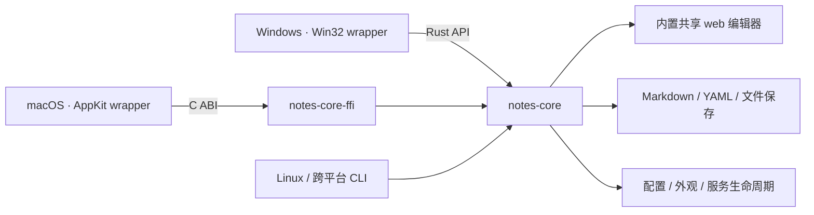

# Notes App

基于 **notes-core + 平台薄壳** 的轻量本地 Markdown 编辑器。Windows、macOS 和 Linux CLI 共用同一份 Rust 核心与网页编辑器；系统默认浏览器提供保留排版的 Live 编辑。

**不依赖 Python、MkDocs、.NET、Windows App SDK 或 WebView2，也不打包浏览器。** 笔记仍然是自己目录中的 `.md` / `.markdown` 文件，不导入数据库、不上传云端。

## 架构



| 目录 | 职责 |
| --- | --- |
| `crates\notes-core\` | 共享服务、Markdown/YAML 渲染、受限文件访问、版本冲突保护、配置和 `NotesCore` 控制器 |
| `crates\notes-core-ffi\` | 将控制器暴露为小型 C ABI，供 Swift 等宿主调用 |
| `crates\notes-cli\` | 跨平台命令行入口，没有桌面 UI 依赖 |
| `web\` | 一份共享网页、Live 编辑器、Metadata、外观和滚动条实现 |
| `Windows\` | Win32 托盘、设置窗口、目录选择、系统浏览器/文件管理器调用 |
| `macOS\` | AppKit 托盘和设置窗口，通过静态链接的 C ABI 使用同一个 core |
| `Shared\Resources\` | 共用的 SVG、PNG 和 ICO 图标 |

平台壳不再启动 MkDocs 或实现另一套文件/渲染逻辑。新增 Rust 宿主可调用 `NotesCore::new`、`save_settings`、`start`、`stop` 和 `open_url`；其他语言使用 `crates\notes-core-ffi\include\notes_core.h`。C ABI 返回的字符串必须由 `notes_core_string_free` 释放，句柄须串行使用并在退出时释放。文件访问的 Windows handle / Unix descriptor 适配仍由 core 统一管理。

## 桌面使用

1. 双击 `Notes.exe`，首次运行在 Settings 中选择存放 Markdown 的目录。
2. 在浏览器中选择笔记，直接在排版后的正文里编辑。标题、加粗、列表和表格会保持原有格式，并随输入动态更新；点击正文不会再把整段展开成 Markdown。
3. 点击 **Save** 或按 **Ctrl+S** 保存。关闭浏览器不会停止服务；左键点击托盘图标直接打开网页，右键打开菜单。目录选择、端口、字体和主题集中在 Settings 中。

更换目录或端口前，需要先从托盘停止当前服务；保存新设置后再启动。关闭或重启服务前请先保存浏览器中的修改。

Settings 支持分别选择英文、中文字体，以及跟随系统、亮色、暗色主题。字体使用本机已安装的字体，不下载网络字体；外观调整会应用到已打开的网页，不重启服务或重建编辑器，也不会清空未保存内容。

不需要 `mkdocs.yml`、虚拟环境、预先构建站点或启动其他服务。支持文件夹导航、筛选、新建笔记、标题大纲、列表、任务列表、引用、代码块、表格及相对图片/笔记链接。页面跟随浏览器的明暗主题，所有编辑器脚本随 EXE 内置，无 CDN 依赖。

界面是一张连续的写作页面：左侧文件/大纲栏可以隐藏，格式工具按需展开，服务目录和维护操作放在菜单内。常用快捷键：

| 快捷键 | 操作 |
| --- | --- |
| `Ctrl+S` | 保存 Markdown |
| `Ctrl+Shift+L` | 显示/隐藏左侧栏 |
| `Ctrl+Shift+1` | 显示大纲 |
| `Ctrl+/` | 切换完整源码和实时编辑 |

侧边栏、正文、源码和预览使用细浮动滚动条：滚动或移动鼠标时显示，闲置后淡出，不占据正文宽度；溢出出现/消失不会挤动布局。仍可使用滚轮、键盘、触摸和拖动滑块滚动；高对比度模式下保留清晰的滑块。

笔记始终保存为 **Markdown 文件**。Live 模式在保留排版的页面里编辑；需要精确操作语法时，可手动打开完整源码、源码与预览并排或只读预览。

### MkDocs YAML 头信息

支持文档开头由 `---` 包围的 YAML 元信息，例如：

```markdown
---
title: "一篇笔记"
description: >-
  用于记录写作和阅读。
tags: [notes, writing]
custom:
  keep: true
---

# 正文标题
```

也支持以 `...` 结束头信息，以及 BOM、LF / CRLF 换行。头信息在 Live 模式中显示为可折叠的信息区，可以单独编辑 YAML，不会渲染成正文的分隔线或标题，也不会进入大纲。修改正文会保留头信息的注释、字段顺序、引号和未知字段；只修改头信息不会重新排版正文。YAML 语法问题会明确提示，原文不会被静默丢弃。

### 保存与兼容性

- 显式保存，不自动覆盖磁盘文件。切换笔记时提示未保存修改；文件被其他程序修改后提示冲突，保留当前编辑内容。
- 保存先写临时文件，再替换原文件；保留 UTF-8 BOM 和原有常见换行格式。未经编辑的文件不会仅因打开而重写。
- 打开、选中或移动光标不会自动改写文件。Live 模式实际修改正文时，Markdown 的语法排版可能被规范化；需要逐字控制时使用源码模式。对于含原始 HTML、脚注等无法安全往返的正文，会明确提示并打开源码模式保护原文，而不是静默删除语法。原始 HTML 不作为网页执行。
- 这是本地 Markdown 编辑器，不是 Typora 的完整替代品，也不是 MkDocs 渲染器。MkDocs 主题、插件、自定义扩展和站点导航配置不迁移；不执行笔记中的原始 HTML/脚本。
- 单篇 Markdown 上限 4 MiB，附件上限 16 MiB。文件列表最多显示 5,000 篇笔记，达到扫描限制时会提示；隐藏目录、依赖目录和符号链接/联接目录不纳入笔记浏览。

服务仅监听 `127.0.0.1`，不提供局域网共享。浏览器应从托盘打开，以取得每次启动生成的访问凭据；重启服务后旧标签页需要重新打开。相对图片从选定目录读取；正文和预览都不自动加载远程图片，原始地址仍保留在 Markdown 中。正文内的链接使用 Ctrl+点击打开。

## Windows 构建

运行环境：Windows 10 1809 或更新版本，以及现代浏览器（Edge、Chrome、Firefox 等）。目标电脑只需要 `Notes.exe`，无需安装开发工具或额外运行时。

构建环境任选一种：

- Rust MSVC 工具链 + Visual Studio C++ Build Tools / Windows SDK。
- Rust `x86_64-pc-windows-gnu` 工具链 + MinGW-w64，确保 `gcc`、`windres` 在 PATH 中。

```powershell
.\Windows\Scripts\build.ps1
.\Windows\Scripts\build.ps1 -Runtime win-x64 -Toolchain gnu
```

生成 `build\windows\win-x64\Notes.exe`。ARM64 使用 `-Runtime win-arm64 -Toolchain msvc`，需要安装对应 Rust target 和 Visual C++ ARM64 构建工具。构建脚本默认根据 Rust host 选择工具链，不在运行时解压 DLL 或网页资源。

普通 Cargo 构建使用仓库中已经生成的前端资源，**不需要 Node.js**。只有修改编辑器前端时才需要 Node.js 22 或更新版本：

```powershell
Set-Location web
npm ci
npm run build
```

前端构建输出需要与前端源码一起提交，然后重新执行 Windows 构建脚本。依赖由 `Cargo.lock` 和 `package-lock.json` 固定；前端第三方许可证随生成资源保留。

图标的可编辑源文件是 `Shared\Resources\NotesIcon.svg`。修改后在 `web` 目录运行 `npm run icons`（Windows 使用本机 Edge，其他平台使用 Playwright Chromium），生成共用的 1024px PNG 和包含 16–256px 九种尺寸的 ICO。普通应用构建直接使用生成好的图标，不需要 Node.js、浏览器构建工具或 Python；浏览器标签页也使用相同图标。

### 开发验证

```powershell
.\Windows\Scripts\build.ps1 -Test
cargo test --locked --workspace --target-dir .\build\rust
cargo build --locked -p notes-cli --target-dir .\build\rust
Set-Location web
npm test
npx playwright test
```

浏览器测试默认直接使用共享 core CLI：Windows 为 `build\rust\debug\notes-core.exe`，其他平台为同目录的 `notes-core`。Windows 使用本机 Edge，其他平台需先运行 `npx playwright install chromium`。可通过 `NOTES_TEST_EXE` 改为测试 Windows wrapper 的诊断入口。测试创建隔离笔记，不读取真实笔记或用户设置。

原生托盘/设置测试需要交互式 Windows 桌面，默认不运行。在仓库根目录执行：

```powershell
$env:NOTES_NATIVE_SMOKE_EXE = (Resolve-Path .\build\windows\win-x64\Notes.exe).Path
cargo test --locked -p notes-app-windows --lib native::tests::isolated_native_settings_and_quit -- --ignored
```

无托盘诊断模式：

```powershell
.\Notes.exe --serve "C:\MyNotes" --port 8123 --ready-file "C:\Temp\notes-ready.json" --stop-file "C:\Temp\notes-stop"
```

`--ready-file` 包含本次服务的浏览器 URL 和访问凭据，仅用于本机诊断，不要分享。创建指定的 `--stop-file` 可正常停止服务。端口占用会明确报错，不会接管或终止其他程序。

## macOS 构建

需要 macOS 13 或更高版本、Rust 工具链和 Xcode Command Line Tools。构建会把 `notes-core-ffi` 静态链接到 Swift / AppKit 程序；不需要额外启动 core 子进程，也不需要 Python 或 MkDocs。

图标使用系统自带的 `sips` / `iconutil` 生成。

```bash
make app
make install
```

生成 `build/Notes.app`，安装到 `~/Applications/Notes.app`。

首次运行会尝试从旧版 UserDefaults 导入目录、端口及自动启动/打开选项；旧偏好不删除。无效目录会提示在设置中修正，不会重新依赖旧版 MkDocs 配置。Windows 环境只能交叉检查 Rust 的 macOS 目标；Swift 链接和 macOS 运行需在 macOS 主机验证。

## Linux / 通用 core CLI

```bash
cargo build --locked --release -p notes-cli --target-dir build/rust
./build/rust/release/notes-core --serve "$HOME/notes" --port 8123
```

终端会输出带访问凭据的本地浏览器 URL，按 Ctrl+C 停止。支持 `--theme system|light|dark`、`--latin-font`、`--cjk-font`，以及诊断用的 `--ready-file` / `--stop-file`。CLI 不读取或修改桌面偏好；不需要 GTK、桌面壳或浏览器内核依赖。

GitHub Actions 对 Windows、Linux、macOS 运行共享 workspace 测试，并在原生主机构建对应 wrapper / CLI。macOS 的 Swift 构建只能由 macOS 主机完成。

## 数据与代码

- Windows 设置：`%LOCALAPPDATA%\NotesApp\settings.json`；笔记在用户选择的原目录中。
- macOS 设置：`~/Library/Application Support/NotesApp/settings.json`；旧 plist 只用于迁移。
- Linux core 设置默认位置：`$XDG_CONFIG_HOME/notes-app/settings.json`，未设置时为 `~/.config/notes-app/settings.json`；CLI 诊断模式不读写它。
- `web\public\`：嵌入 core 的网页和生成资源；`web\frontend\`：编辑器与外观源码。
- 根目录 `Cargo.toml` / `Cargo.lock` 管理统一 Rust workspace，`web\package-lock.json` 固定前端依赖。

布局与交互研究参考 [Typora 文件管理](https://support.typora.io/File-Management/)、[实时预览说明](https://support.typora.io/Quick-Start/#live-preview)和 [Markdown 行内编辑说明](https://support.typora.io/Markdown-Reference/#span-elements)。本项目采用保留排版的原位编辑，源码模式由用户主动切换，并非 Typora 全部行为的逐项复刻；程序不包含 Typora 的截图、图标或主题代码。
